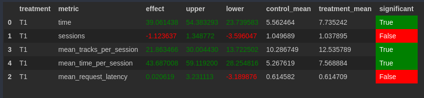

# Домашнее задание, Максонов Артем

## Идея:
Давайте считать, что трек понравился пользователю, если он достаточно долго его слушал.
Тогда будем рекомендовать треки, похожие на понравившиеся, используя нейросетевой рекомендер.

## Детали:
Заведем мапу `good_tracks`, где ключ - user, а значение - треки, который ему понравились.
Время прослушивания, после которого трек считается понравившемся - 0.5.
Если взять выше 0.5, получалось слишком мало рекомендаций, а ниже - попадались "плохие треки".
Если понравившихся треков пока нет(good_tracks пуст), будем выбирать случайный трек.
Иначе, выбираем случайный из ранее понравившихся треков и выдаем рекомендации по этому треку на основе нейросетевого рекомендера.

## Результат


## Запуск
Способ запуска не претерпел изменений.

Запуск botify (подробнее [тут](botify/README.md))
```
cd botify/
docker-compose up -d --build 
```

Запуск sim (подробнее [тут](sim/README.md))
```
cd sim/
python sim/run.py --episodes 1000 --config config/env.yml single --recommender remote --seed 31337 
```

После скачиваем логи:
```
docker cp recommender-container:/app/log/ /tmp/
```

